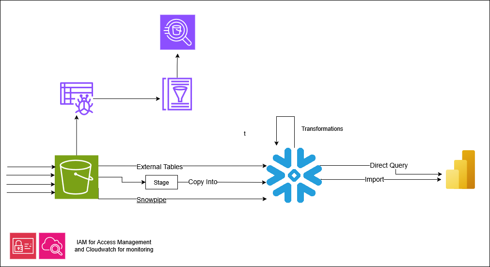
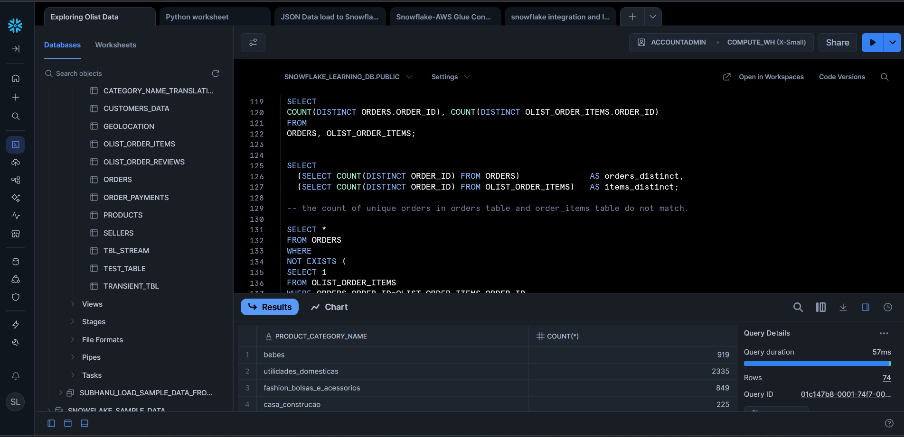
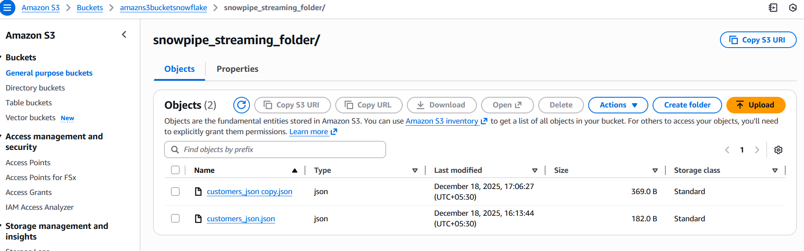
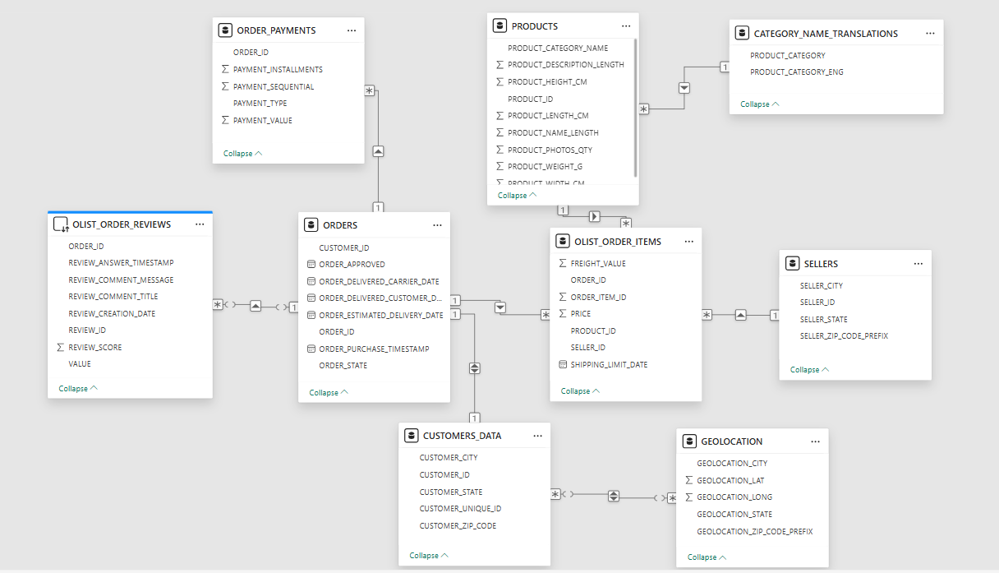

## End to End Data Engineering Pipeline using Olist Ecommerce Data

Olist is a major Brazilian Ecommerce marketplace that connects thousands of small businesses to major sales channels. Unlike traditional retailers that sell their own stock, Olist acts as a SaaS (Software as a Service) solution that connects small and medium-sized businesses across Brazil to larger marketplaces like Mercado Livre and Amazon. 

100,000+ records of real commercial data across 9 relational tables of data between 2016-2018 and this is one of the most popular real-world datasets being used for ecommerce analytics.

Instead of doing a regular analysis using this dataset, I used this real world to create a production scale data pipeline using Amazon Web Services, Snowflake and Power BI.

System architecture is as follows,

**Tech Used**

🔹 **Data Lake (AWS S3):** Served as the primary landing zone for raw Olist CSV files.

🔹 **Data Catalog & Discovery:** Used **AWS Glue Catalog** and **Crawlers** to automate schema detection and maintain a central metadata repository. 

🔹 **Ad-hoc Querying (Amazon Athena):**

🔹 **Snowflake:** Architected the final warehouse in Snowflake, managed preliminary transformations and cleaning. 

🔹 **Power BI:** Developed an interactive dashboard to track critical KPIs like delivery performance, product category trends, and regional sales distribution.

This project also simulates a real time stream of JSON files that goes through the pipeline. 

### Final Power BI Dashboard Output

 

 

## Setup Details

All AWS Services are deloyed in ap-south-1 ( Asia Pacific (Mumbai)) region. 

To reduce data transfer fees between locations and for the each on integration, Snowflake is hosted on the same data center location. (ap-south-1)

all SQL files and Power BI(.pbix) file is available inside the repo.

all Olist Data files are uploaded to s3 bucket. The 9 relational Tables are,
1. Customers
2. Orders
3. Order Items
4. Order Reviews
5. Order Payments
6. Sellers
7. Geolocation
8. Products
9. Category name translations

Kaggle Dataset Link: https://www.kaggle.com/datasets/olistbr/brazilian-ecommerce

These are then crawled in AWS Glue for cataloging, crawled data was prefixed with separate folder for each file inside the data folder in S3 so that the crawler would better work. Otherwise Athena will return zero results though the tables would be available in data catalog 

these cataloged tables are then used inside AWS Athena for Querying without loading it elsewhere

Athena was used to query the data in s3 to better understand structure of the data before loading into Snowflake. Athena query results were set to be stored in the same bucket inside the /athena_results/ folder.

Loading data from S3 to Snowflake was done in 3 ways,
1. Batch loading using an external stage
2. External Table on top of s3 without loading (for customer reviews table)
3. Snowpipe streaming ( for the simulated JSON file streams)

Once the data was loaded to snowflake, we can work with the data inside of it to do our exploratory analysis.

Compute_WH of size X-Small was set to auto_suspend=50 and auto_resume=True with a max_cluster_count set to 2. 

Transformations inside Snowflake

These categories were added to the category name translations to be inclusive of all categories in products table  
`INSERT INTO CATEGORY_NAME_TRANSLATIONS(PRODUCT_CATEGORY, PRODUCT_CATEGORY_ENG)
VALUES('portateis_cozinha_e_preparadores_de_alimentos','Portable Kitchen Appliances and Food Preparers'), ('pc_gamer','gaming PC');`

exploratory analysis done inside snowflake is available as file - olist_exploratory.sql

Real time data ingestion using Snowpipe streaming that land in s3 which are then passed into snowflake. 

Power BI connection to Snowflake was done using both import and directQuery. (Customer reviews table which was also pulled to snowflake using an external table was loaded into power BI also using directQuery)

Data Model in Power BI

Data Model was build following the connection structures in the tables. 

Transformations inside of Power BI

- Category Name translations were merged with products table.
- Data type changes to currency fields to be Brazillian Currency - R$ (Real)
- Calculated columns to get the total charge (Price+Freight Cost)
- Renamed column 'Urder_puurchase_timestamp' -> 'order_purchase_timestamp'
- Custom measuures for Items in an order & Freight Value out of total

  
### Final Dashboard View

These KPIs present interesting insights into Olist Customers, Orders, Products and Sellers. All of the Visualizations are fully interactive.

## Key Findings on the Dataset

I was able to uncover few things that were not available in most of the analysis done on this dataset. All insights are gathered by studies the data and the background study into real world business operations of Olist.

1. all product ids are linked to order items. All the products have been included in orders in order items. this means all given products in products table are a list of products that were ordered during the period. not a full list of products in olist that may include products with 0 orders as well. 

2. even the products with no product name and category and description has been ordered. This could be because there's products in the Olist platform that are listed and orderde by customers that has no assigned name/ category. But for all the products that has been ordered except a couple, product dimensions(l,h,w and weight) are available

3. product items(order_items) from multiple sellers can be included in the same order. 
EXAMPLE IS THE FOLLOWING ORDER ID - 014405982914c2cde2796ddcf0b8703d 

4. ALL ORDERS ARE NOT THERE IN OLIST_ORDER_ITEMS TABLE. 
the orders that are not in order items are in states - unavailable, cancelled or created. 

    all 5 created orders are not there in order items table. but there are records in order_items of orders in states unavailable and cancelled also. but those that are in orders but not in items are falling into one of the above mentioned states(unavailable, cancelled or created).

5. even if the customer has ordered multiple of the same product from the same seller, they are still treated as individual items and freight value is still distributed between the items. 

6. Each order is assigned a separate customer_id. if i make 2 orders, 2 of those orders will have 2 distinct customer ids.

7. The order value can be paid with multiple payment methods. we can pay one part of the order value using a credit card and the rest using a voucher etc. payment_sequential column lists the payment methods used. 

    The payment value of all the payment methods are equal to the sum of total item value + freight in orders table for a specific order. 
  example order_id-'5cfd514482e22bc992e7693f0e3e8df7'

8. there's only one record per order(order_id) and the recorded order state is the latest state of the order. it doesn't keep records for each of the states in which the order may go through from staritng the order, invoiced, cash paid , cancelled etc. Therefore we can be confident that each record is a distinct order.  
-- in this case, delivered, shipped, unavailable, cancelled, invoiced, created

otherwise, during the creation of the dataset, the creators have decided to only share the latest state for the orders

9. THE SAME PRODUCT ORDER CAN HAVE MULTIPLE AS MANY REVIEWS FROM THE CUSTOMERS. example order_id- 03c939fd7fd3b38f8485a0f95798f1f6, there is no rule as one order to have only one review  by the customer.

also, Not all orders have reviews. For example a cancelled order may not have a review though it's in the orders table. This is the the expected behavior but that doesn't mean customers for cancelled orders cannot leave reviews. even cancelled, unavailable and invoiced orders have reviews
 
One the reviews for unavailable orders Order_id(b07abc8b9acaf00e79b4657419f469f3): When I went to buy the product, it said it was in stock. When I bought it, the order was put on hold because it was no longer in stock. However, it was still charged to my card.
 
therefore regardless of the order state, reviews can be left for the products. 

10. The structure of orders and order_items table represents how Olist basically handles its own orders. one order review said,

"Um ponto negativo que achei foi a cobrança de 3 taxas de entregas, sendo que comprei os 3 produtos iguais numa só compra.
--E mesmo comprando os produtos juntos, chegaram separados."  
meaning: “One negative point I noticed was being charged three delivery fees, even though I bought three identical products in a single purchase. And even though I bought the products together, they arrived separately.”

11. the dataset is not inclusive of all order transactions in the Olist platform during the period either. The data provenance is done by getting a random sample of the orders during the period covered (2016-2018). But this random sample should be enough to arrive to reach at conclusions regarding all data points of Olist for the duration. 

12. ALL SELLERS ARE also not included in the sellers table. Meaning this is not a complete dataset of all the sellers that exist in olist platform during that period. what's included in the sellers dataset are only the sellers that correspond to the orders where order items relate to.

    Same can be said about the products table (as in point 01 above). Because of this, we couldn't do an analysis of sellers who made their sales against who did not during this period. 

---
By [Subhanu](https://github.com/subhanu-dev) 🚀
